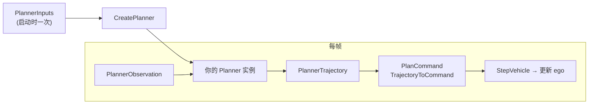
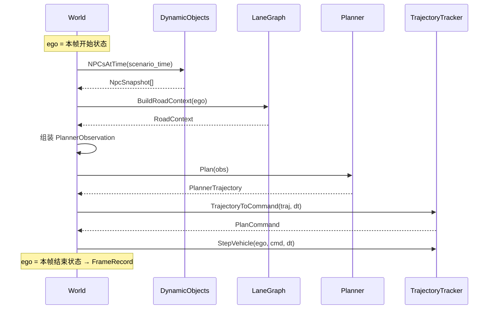

# Planner 开发指南

本文说明在本仓库中如何实现一个新的 **Planner**：输入/输出契约、与仿真的关系、推荐封装方式、最小示例与测试命令。可直接交给实现 Planner 的同事阅读。

---

## 1. Planner 在系统里的位置

Planner **不负责**推进仿真、**不负责**写 log、**不负责** grading。它只做一件事：

> 每一仿真步，根据当前观测，输出一段短期轨迹 `PlannerTrajectory`；World 从中取出**第一个控制步**驱动车辆。



**重要约定：**

- Grading **看不到** `planned_trajectory`、参考线、goal；只能看到执行后的物理态。
- `PlannerObservation.road` 会传入，但 **框架不强制你用**；现有 `local_dwa` 主要用 ego + npcs + 静态参考线。
- 应把 `Plan()` 实现成 **无状态或只读缓存**（除构造函数里从 `PlannerInputs` 缓存的静态数据外）；不要用可变成员在 `Plan()` 里跨帧累积状态，除非很清楚后果。

---

## 2. 接口定义（必须实现）

头文件：`sim/cpp/planner.h`

```cpp
class Planner {
 public:
  virtual ~Planner() = default;
  virtual std::string Name() const = 0;
  virtual proto::PlannerTrajectory Plan(const proto::PlannerObservation& obs) const = 0;
};
```

| 方法 | 含义 |
|------|------|
| `Name()` | 返回 planner 逻辑名（日志用，可与注册名相同） |
| `Plan(obs)` | **每帧调用一次**，返回轨迹 |

工厂：

```cpp
std::unique_ptr<Planner> CreatePlanner(
    const std::string& planner_name,   // CLI: --planner <name>
    const proto::PlannerInputs& inputs,
    std::string* error);
```

---

## 3. 输入：两层结构

Planner 的输入分 **静态（整段仿真不变）** 和 **动态（每帧变化）**。

### 3.1 静态输入 — `PlannerInputs`（构造时注入）

定义：`sim/proto/sim/runtime.proto`

```protobuf
message PlannerInputs {
  Pose2D goal = 1;
  double desired_speed_mps = 2;
  repeated ReferencePoint reference_points = 3;
  VehicleParams ego_vehicle = 4;
  PlannerConfig trajectory_config = 5;
}
```

由 `sim/cpp/main.cc` 在启动时组装，经 `CreatePlanner(name, planner_inputs)` 传给你的构造函数。**整个 `Run()` 期间不变。**

#### `goal`（`Pose2D`）

| 字段 | 单位 | 说明 |
|------|------|------|
| `x`, `y` | m | 场景目标点（通常来自 `scenario_meta`） |
| `yaw` | rad | 目标朝向（部分 planner 可忽略） |

用途：终点判定、无参考线时的 fallback 目标。

#### `desired_speed_mps`

| 单位 | 说明 |
|------|------|
| m/s | CLI `--desired-speed` 与地图限速的较小值 |

用途：巡航目标速度上限；跟车时应再向下修。

#### `reference_points[]`（`ReferencePoint`）

| 字段 | 单位 | 说明 |
|------|------|------|
| `x`, `y` | m | 参考路径点（地图 routing 或 SDC 轨迹） |
| `heading` | rad | 该点切向（可选） |
| `speed` | m/s | 该点建议速度（地图限速采样） |
| `valid` | bool | 无效点应跳过 |

来源：

- `--reference-source map` → `BuildMapReference()`，步长 `--reference-step`（默认 1m）
- `--reference-source sdc` → 自车真值轨迹

典型用法（与现网 `local_dwa` 一致）：

1. `ClosestValidRefIndex(ref, ego.x, ego.y)` 找最近有效点
2. 向前 lookahead（如 `ref_idx + 15`）取预瞄点 `(target_x, target_y)`
3. 用 `ref[ref_idx].speed()` 限制 `target_speed`

**注意：** 参考线可能自相交（如 waymo_scenario_244 末尾），最近点会跳变——可考虑单调 `ref_idx`、Frenet 投影等改进。

#### `ego_vehicle`（`VehicleParams`）

| 字段 | 单位 | 说明 |
|------|------|------|
| `length`, `width` | m | 外形 |
| `wheelbase` | m | 轴距（转向运动学） |
| `rear_overhang` | m | 后悬（OBB 中心偏移） |
| `max_speed` | m/s | 速度上限 |
| `max_accel`, `max_decel` | m/s² | 纵向加减速上限 |
| `max_steer`, `max_steer_rate` | rad, rad/s | 转向及变化率上限 |

用途：内部 rollout、DWA 采样范围、与 `StepVehicle` 一致的动力学限幅。

#### `trajectory_config`（`PlannerConfig`）

| 字段 | 默认 | 说明 |
|------|------|------|
| `horizon_s` | 3.0 | `BuildTrajectoryFromCommand` 向前 rollout 时长 |
| `point_dt_s` | 等于 `--dt` | rollout 时间步 |

---

### 3.2 动态输入 — `PlannerObservation`（每帧 `Plan(obs)`）

```protobuf
message PlannerObservation {
  int64 frame_id = 1;
  int64 timestamp_us = 2;
  double dt = 3;
  VehicleState ego = 4;
  repeated NpcSnapshot npcs = 5;
  RoadContext road = 6;
}
```

#### 时间字段

| 字段 | 说明 |
|------|------|
| `frame_id` | 从 0 递增的仿真步编号 |
| `timestamp_us` | 场景时间（微秒）= `dynamic.t0 + frame_id * dt` |
| `dt` | 仿真步长（秒），与 `WorldConfig.dt` 一致 |

#### `ego`（`VehicleState`）— **本帧积分前状态**

| 字段 | 单位 | 说明 |
|------|------|------|
| `x`, `y` | m | 位置 |
| `heading` | rad | 航向 |
| `speed` | m/s | 标量速度 |
| `acceleration` | m/s² | 上一帧执行的加速度 |
| `steer` | rad | 当前方向盘角 |

**不要和 `FrameRecord.ego` 混淆：** log/grading 里的是 **积分后** 状态；`Plan()` 收到的是 **积分前**。

#### `npcs[]`（`NpcSnapshot`）

| 字段 | 单位 | 说明 |
|------|------|------|
| `id` | - | 轨迹 ID |
| `object_type` | string | 如 vehicle, pedestrian |
| `x`, `y`, `z` | m | 位置 |
| `heading` | rad | 朝向 |
| `vx`, `vy` | m/s | 速度（可用于预测） |
| `length`, `width`, `height` | m | 包围盒 |

来源：`World` 对 `DynamicObjects` 在 `scenario_time` 做线性插值；不含自车（SDC）。

避障/跟车应使用 **车体坐标系** 或 OBB（可参考 `planner.cc` 里 `MakeEgoObb` / `MakeNpcObbAt` / `Overlap`）。

#### `road`（`RoadContext`）— 可选使用

| 字段 | 单位 | 说明 |
|------|------|------|
| `dist_to_left_boundary_m` | m | 到左车道线距离（正值=在车道内） |
| `dist_to_right_boundary_m` | m | 到右车道线距离 |
| `dist_to_road_edge_m` | m | 到路缘/标线（地图有数据时） |
| `closest_lane_id` | - | 最近车道 ID |
| `lateral_offset_m` | m | 相对车道中心线横向偏移（左正） |

由 `BuildRoadContext(lane_graph, ego)` 计算。若要做车道保持，可直接用这些量做代价项或约束。

---

## 4. 输出：`PlannerTrajectory`

```protobuf
message TrajectoryPoint {
  double t_s = 1;
  double x = 2;
  double y = 3;
  double heading = 4;
  double speed = 5;
  double target_acceleration = 6;
  double steering_angle = 7;
  double desired_speed_mps = 8;
}

message PlannerTrajectory {
  repeated TrajectoryPoint points = 1;
}
```

### 4.1 World 实际怎么用你的输出

每帧在 `sim/cpp/world.cc` 中：

```cpp
const proto::PlannerTrajectory trajectory = planner.Plan(obs);
const proto::PlanCommand cmd = TrajectoryToCommand(trajectory, cfg.dt());
StepVehicle(&ego, cmd, cfg.dt(), params_);
```

`TrajectoryToCommand` 逻辑（`sim/cpp/trajectory_tracker.cc`）：

1. 主要取 **`points[0]`** 的 `target_acceleration`、`steering_angle`、`desired_speed_mps`
2. 若存在 `points[1]` 且 `t_s ≈ dt`，可能用速度差修正加速度

因此：**第一个轨迹点必须对应当前 `obs.ego` 起、下一步 `dt` 内要执行的控制**；后面各点是 rollout 预览，World **不会逐步跟踪整条轨迹**。

### 4.2 推荐输出方式：`BuildTrajectoryFromCommand`

不要手写整条轨迹各状态，除非你 rollout 与 `StepVehicle` 不一致。

```cpp
#include "cpp/trajectory_tracker.h"

proto::PlannerTrajectory MyPlanner::Plan(const proto::PlannerObservation& obs) const {
  proto::PlanCommand cmd = ComputeCommand(obs);  // 你的核心算法
  return BuildTrajectoryFromCommand(cmd, obs.ego(), params_, traj_cfg_);
}
```

`BuildTrajectoryFromCommand` 会：

- 从 `obs.ego` 出发
- 用与仿真相同的 `StepVehicle` 和固定 `cmd`
- 每 `point_dt_s` 打一个 `TrajectoryPoint`（含位置、速度、控制量）
- 持续 `horizon_s` 秒

这样轨迹与仿真动力学一致，也满足 `TrajectoryToCommand` 对 `points[0]`/`points[1]` 的假设。

### 4.3 `PlanCommand` 字段（你真正要算的东西）

```protobuf
message PlanCommand {
  double target_acceleration = 1;
  double steering_angle = 2;
  double desired_speed_mps = 3;
}
```

| 字段 | 单位 | 仿真中的处理 |
|------|------|----------------|
| `target_acceleration` | m/s² | clamp 到 `[-max_decel, max_accel]` |
| `steering_angle` | rad | clamp 到 `±max_steer`，并按 `max_steer_rate` 限速 |
| `desired_speed_mps` | m/s | 写入轨迹点；grading 的 planning_limit 会读帧末 `FrameRecord.command` 里的该值 |

`desired_speed_mps` 不直接参与 `StepVehicle` 积分，但应设成期望的巡航速度，供 metric 与调试。

---

## 5. 每帧数据流（时序）



| 字段 | 时刻 |
|------|------|
| `PlannerObservation.ego` | 本帧积分**前** |
| `FrameRecord.ego` | 本帧积分**后** |
| `FrameRecord.road` | 用积分**前** ego 计算 |
| `FrameRecord.command` | 本帧实际执行的控制量 |
| `FrameRecord.planned_trajectory` | 规划器输出的整段 rollout（仅 sim 保留，grading 不收） |

---

## 6. 怎么封装一个新 Planner

### 6.1 推荐类结构

```cpp
class MyCustomPlanner final : public Planner {
 public:
  explicit MyCustomPlanner(const proto::PlannerInputs& inputs)
      : goal_(inputs.goal()),
        desired_speed_mps_(inputs.desired_speed_mps()),
        reference_points_(inputs.reference_points().begin(),
                          inputs.reference_points().end()),
        params_(inputs.ego_vehicle()),
        traj_cfg_(inputs.has_trajectory_config()
                      ? inputs.trajectory_config()
                      : DefaultTrajectoryConfig(inputs)) {}

  std::string Name() const override { return "my_custom"; }

  proto::PlannerTrajectory Plan(const proto::PlannerObservation& obs) const override {
    const auto cmd = PlanStep(obs.ego(),
                              {obs.npcs().begin(), obs.npcs().end()},
                              obs.frame_id(),
                              obs.road());
    return BuildTrajectoryFromCommand(cmd, obs.ego(), params_, traj_cfg_);
  }

 private:
  proto::PlanCommand PlanStep(
      const proto::VehicleState& ego,
      const std::vector<proto::NpcSnapshot>& npcs,
      int frame_id,
      const proto::RoadContext& road) const;

  proto::Pose2D goal_;
  double desired_speed_mps_;
  std::vector<proto::ReferencePoint> reference_points_;
  proto::VehicleParams params_;
  proto::PlannerConfig traj_cfg_;
};
```

**分层建议：**

| 层 | 职责 |
|----|------|
| `PlanStep` | 纯控制：输入 ego/npcs/… → 输出 `PlanCommand` |
| `Plan` | 薄封装：`PlanStep` + `BuildTrajectoryFromCommand` |
| 构造函数 | 从 `PlannerInputs` 缓存只读数据 |

### 6.2 注册到工厂（必须）

在 `sim/cpp/planner.cc` 匿名命名空间末尾添加：

```cpp
const bool kRegisteredMyCustom = RegisterPlanner(
    "my_custom",  // CLI --planner my_custom
    [](const proto::PlannerInputs& in) {
      return std::make_unique<MyCustomPlanner>(in);
    });
```

并在 `CreatePlanner` 里加上 `(void)kRegisteredMyCustom;`，防止链接器裁掉静态注册（与现有三个 planner 相同）。

**注册名** = `bazel run ... --planner <注册名>`。

### 6.3 可复用的工具

| 符号 | 位置 | 用途 |
|------|------|------|
| `StepVehicle` | `sim/cpp/trajectory_tracker.h` | 与仿真一致的单步积分 |
| `BuildTrajectoryFromCommand` | 同上 | 生成标准输出轨迹 |
| `TrajectoryToCommand` | 同上 | World 从轨迹取首步控制（一般不需自己调） |
| `ClosestValidRefIndex` / `RefTangent` | `sim/cpp/planner.cc`（当前未导出） | 参考线工具 |
| `MakeEgoObb` / `MakeNpcObbAt` / `Overlap` | `planner.cc` + `sim/cpp/geometry.h` | 避障 |
| `LeaderLimitedSpeedDwa` | `planner.cc` | 跟车限速示例 |

若需复用未导出函数，可抽到 `planner_utils.h`；最简单是先写在 `planner.cc` 或抄到自家类里。

### 6.4 BUILD 依赖

`sim/cpp/BUILD` 中 `planner` target 已依赖：

- `//proto/sim:runtime_cc_proto`
- `:trajectory_tracker`
- `:geometry`

新类写在 `planner.cc` 内 **无需改 BUILD**；若新建 `my_planner.cc`，把文件名加入 `planner` 的 `srcs` 即可。

---

## 7. 现有三个 Planner 对照

| 注册名 | 类名 | 难度 | 行为摘要 |
|--------|------|------|----------|
| `goal_seek` | `GoalSeekPlanner` | 最低 | 只盯 `goal`，纯跟踪 + 定速 |
| `reference_tracker` | `ReferenceTrajectoryPlanner` | 中 | 参考线预瞄 + 跟车限速 |
| `local_dwa` | `LocalDwaPlanner` | 高 | 参考线 + DWA 采样避障 + fallback |

**建议学习顺序：** `goal_seek` → `reference_tracker` → `local_dwa`。

---

## 8. 运行与自测

### 8.1 编译

```bash
cd sim
bazel build //cpp:sim_runner
```

### 8.2 只跑仿真（不 grading）

```bash
bazel run //cpp:sim_runner -- \
  --scenario-dir ../scenarios/waymo_scenario_244 \
  --output ../output/log/my_sim_log.json \
  --planner my_custom \
  --reference-source map \
  --reference-step 1.0 \
  --dt 0.1 \
  --max-seconds 0 \
  --cpp-mode off
```

### 8.3 仿真 + grading

```bash
bazel run //cpp:sim_runner -- \
  --scenario-dir ../scenarios/waymo_scenario_244 \
  --output ../output/log/my_sim_log.json \
  --planner my_custom \
  --reference-source map \
  --dt 0.1 \
  --max-seconds 0 \
  --cpp-mode both \
  --grading-bin ../grading_mini/bazel-bin/src/entry/grading_main \
  --grading-report ../output/report/my_grading_report.json \
  --metrics-config ../grading_mini/config/metrics_default.json
```

### 8.4 可视化

```bash
python3 tools/viz_sim.py \
  --scenario-dir scenarios/waymo_scenario_244 \
  --sim-log output/log/my_sim_log.json \
  --animate --fps 120 \
  --output output/viz/my_custom.gif
```

---

## 9. 契约清单（实现前必读）

1. **`Plan()` 必须 `const`**：不要依赖可变成员存帧间状态（除非线程安全且文档化）。
2. **输出轨迹第一点对齐 `obs.ego`**：用 `BuildTrajectoryFromCommand` 可自动保证。
3. **控制量要在 `VehicleParams` 限幅内**：超出会被 `StepVehicle` 截断，行为可能和预期不符。
4. **每帧重规划**：World 不会执行你 3s 轨迹的后续点，只执行首步。
5. **不要指望 grading 看到你的计划**：只优化可观测物理行为。
6. **`frame_id` 可作参考线 fallback**：`ref_idx` 无效时可用 `min(frame_id, ref.size-1)`（见 `local_dwa`）。
7. **NPC 坐标系**：世界系；跟车/避障建议变换到 ego 前向 `fx, fy`。

---

## 10. 最小可运行骨架

```cpp
class MyCustomPlanner final : public Planner {
 public:
  explicit MyCustomPlanner(const proto::PlannerInputs& inputs)
      : goal_(inputs.goal()),
        desired_speed_(inputs.desired_speed_mps()),
        params_(inputs.ego_vehicle()),
        traj_cfg_(inputs.has_trajectory_config() ? inputs.trajectory_config()
                                                 : DefaultTrajectoryConfig(inputs)) {}

  std::string Name() const override { return "my_custom"; }

  proto::PlannerTrajectory Plan(const proto::PlannerObservation& obs) const override {
    proto::PlanCommand cmd;
    cmd.set_desired_speed_mps(desired_speed_);

    const double dx = goal_.x() - obs.ego().x();
    const double dy = goal_.y() - obs.ego().y();
    const double dist = std::hypot(dx, dy);
    const double desired_h = std::atan2(dy, dx);
    const double err = std::atan2(std::sin(desired_h - obs.ego().heading()),
                                  std::cos(desired_h - obs.ego().heading()));
    const double v_tgt = (dist < 3.0) ? 0.0 : desired_speed_;
    cmd.set_target_acceleration(1.0 * (v_tgt - obs.ego().speed()));
    cmd.set_steering_angle(0.8 * err);

    return BuildTrajectoryFromCommand(cmd, obs.ego(), params_, traj_cfg_);
  }

 private:
  proto::Pose2D goal_;
  double desired_speed_;
  proto::VehicleParams params_;
  proto::PlannerConfig traj_cfg_;
};

const bool kRegisteredMyCustom = RegisterPlanner(
    "my_custom", [](const proto::PlannerInputs& in) {
      return std::make_unique<MyCustomPlanner>(in);
    });
```

---

## 11. 静态 vs 动态输入对照

| 数据 | 生命周期 | 进入 Planner？ | 进入 Grading？ |
|------|----------|----------------|----------------|
| `reference_points[]` | 全程固定 | ✅（构造函数缓存） | ❌ |
| `goal`, `desired_speed` | 全程固定 | ✅ | ❌ |
| `VehicleParams` | 全程固定 | ✅ | ✅（`ego_vehicle`） |
| `ego` 每帧 | 动态 | ✅（`obs`，帧初） | ✅（`vehicle_state`，帧末） |
| `npcs` 每帧 | 动态 | ✅ | ✅ |
| `road` 每帧 | 动态 | ✅（可选用） | ✅ |
| `planned_trajectory` | 每帧 | Planner 输出 | ❌ |
| `StaticMap` | 固定 | 间接（建参考线） | ✅（frame 0 `scene_map`） |

---

## 12. 相关文件索引

| 文件 | 内容 |
|------|------|
| `sim/proto/sim/runtime.proto` | 所有 Planner 消息定义 |
| `sim/cpp/planner.h` | 抽象接口 |
| `sim/cpp/planner.cc` | 三个参考实现 + `RegisterPlanner` |
| `sim/cpp/world.cc` | 每帧组 `obs`、调 `Plan`、执行 `StepVehicle` |
| `sim/cpp/main.cc` | 组 `PlannerInputs`、CLI |
| `sim/cpp/trajectory_tracker.cc` | `StepVehicle` / `BuildTrajectoryFromCommand` / `TrajectoryToCommand` |
| `sim/cpp/map_query.cc` | `RoadContext` 计算 |
| `sim/cpp/geometry.h` | OBB 碰撞 |
| `sim/cpp/grading_convert.cc` | 仿真帧 → grading 输入（不含轨迹） |

---

## 13. CLI 参数（main 传给 Planner 的上下文）

| 参数 | 默认 | 影响 |
|------|------|------|
| `--planner` | `local_dwa` | 注册名 |
| `--reference-source` | `map` | 参考线来源 |
| `--reference-step` | `1.0` | 地图参考线采样间距 (m) |
| `--desired-speed` | `13.9` | 期望巡航速度 (m/s) |
| `--dt` | `0.1` | 仿真步长、轨迹点间隔 |
| `--max-seconds` | `0` | 0 = 跑满场景时长 |
| `--ego-length` 等 | 见 `main.cc` | `VehicleParams` |

当前注册机制为 **编译期静态注册**（`RegisterPlanner`），无运行时动态加载插件。
